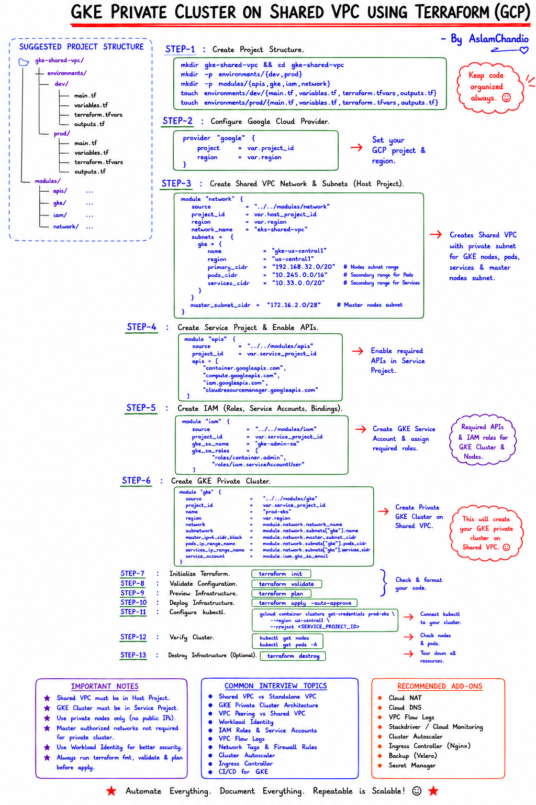
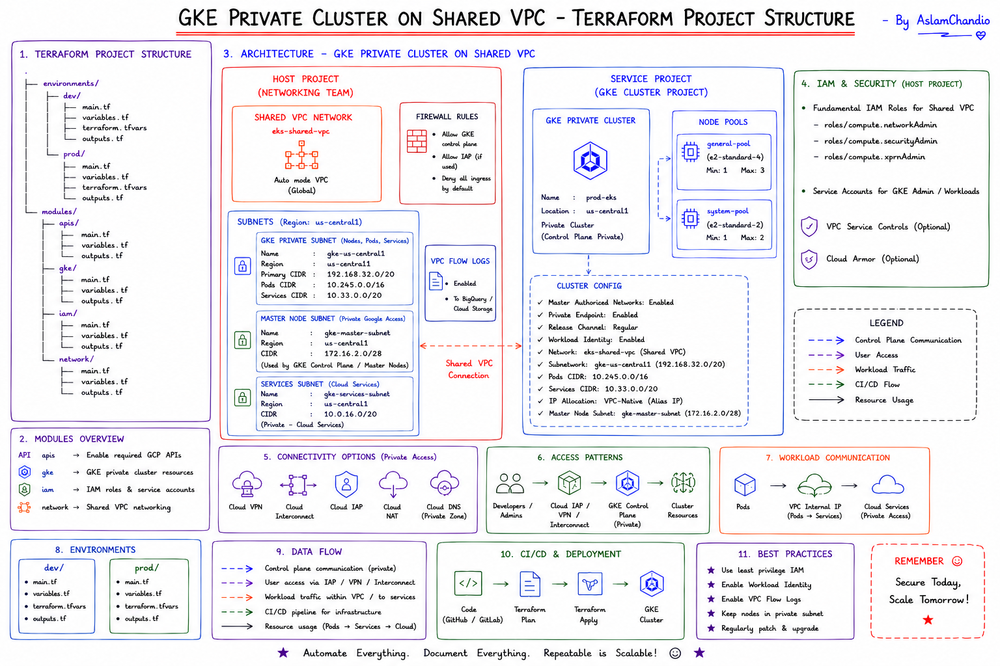

# gcp-sharedvpc-gke-platform

Production-grade, modular Terraform for a **cross-project private GKE platform on a Shared VPC** in Google Cloud — composed per environment (`dev` / `prod`) with remote state, least-privilege IAM, and a security-hardened cluster.

> 📖 **Full documentation:** [`terraform/README.md`](terraform/README.md) — architecture, variable design, deploy/destroy runbooks, single-node tuning, and troubleshooting.

---

## 📐 Reference diagrams

**Step-by-step build guide** — project structure → provider → network → APIs → IAM → cluster → deploy → verify:



**Architecture & project structure** — Host/Service projects, subnets, IAM, connectivity, data flow, and best practices:



---

## What this provisions

```
HOST project                          SERVICE project
┌──────────────────────────┐          ┌──────────────────────────────────┐
│ Shared VPC (it-<env>-vpc) │  attach  │ Private GKE (VPC-native)          │
│  ├─ gke subnet + 2nd ranges──────────▶│  ├─ system node pool (on-demand) │
│  ├─ proxy subnet (L7 LB)  │          │  ├─ default pool (Spot, optional) │
│  ├─ Cloud Router + NAT    │          │  └─ NAP / Compute Classes (burst) │
│  └─ deny-all firewall     │          │  Workload Identity · Shielded·DPv2│
└──────────────────────────┘          └──────────────────────────────────┘
```

- **Shared VPC** host/service attachment, subnets (sliced), proxy-only subnet for Gateway API, Cloud Router + Cloud NAT for private-node egress, deny-all ingress firewall baseline.
- **Private GKE** cluster (no public node IPs), VPC-native, Dataplane V2 (eBPF), Workload Identity, Shielded nodes, dedicated least-privilege node service account.
- **Gateway API** (`CHANNEL_STANDARD`) for L7 traffic — preferred over legacy Ingress — plus **Dataplane V2 observability**: flow **metrics** and the flow-logging **relay** (Hubble) streamed to Cloud Monitoring.
- **Node Auto-Provisioning (NAP)** backing Custom Compute Classes; on-demand `system` pool always on; an **optional** Spot `default` pool gated by `default_pool_enabled` (currently disabled in both envs).

## Layout

```
.
└── terraform/
    ├── modules/            apis · network · iam · gke   (reusable, parameterised)
    ├── environments/
    │   ├── dev/            fast, disposable             (GCS state prefix dev/)
    │   └── prod/           regional, hardened           (GCS state prefix prod/)
    └── README.md           ← full guide
```

Each environment is an independent **root module** with its own GCS state prefix
(backend bucket `aslam-terraform-bucket`). Modules are shared; values live in
per-env `*.auto.tfvars`.

## Quick start

```bash
git clone https://github.com/aslamchandio/gcp-sharedvpc-gke-platform.git
cd gcp-sharedvpc-gke-platform/terraform/environments/dev   # or environments/prod

# edit network.auto.tfvars + gke.auto.tfvars (projects, CIDRs, authorized networks)
terraform init
terraform fmt -check -recursive && terraform validate
terraform plan -out tfplan          # review the artifact, never blind-apply
terraform apply tfplan

# connect to the private cluster (the output prints the exact command)
$(terraform output -raw get_credentials_command)
```

## Security posture

Principle of least privilege throughout: private nodes only, Workload Identity (no
node keys), Shielded nodes, scoped Shared-VPC subnet IAM, deny-all ingress baseline,
and a dedicated node service account. See [`terraform/README.md`](terraform/README.md)
for the full breakdown and the dev-vs-prod matrix.

> **Note:** `*.auto.tfvars` carry no secrets — project IDs, CIDRs, and your
> control-plane authorized-network IP only. Real secrets belong in Secret Manager.

## License

Internal / unlicensed unless stated otherwise.
